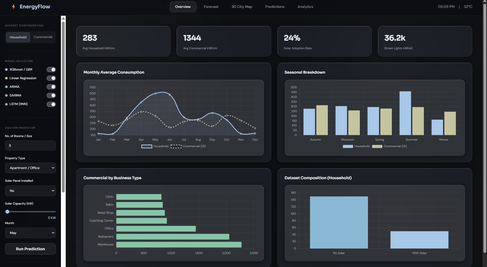
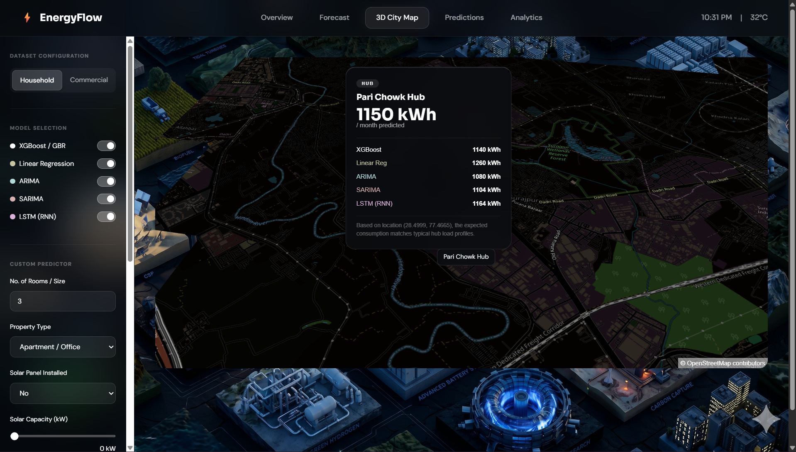
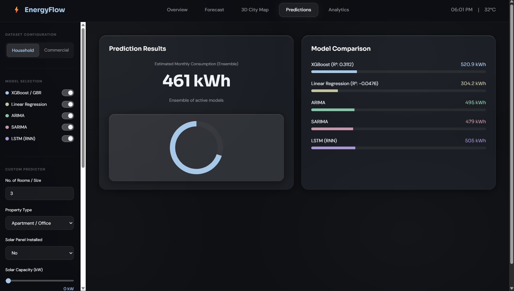

# EnergyFlow Dashboard ⚡

A high-fidelity, predictive energy consumption dashboard featuring a dynamic 3D city map, ensemble machine learning models, and a sleek Apple VisionOS-inspired "liquid glass" interface.



## 🚀 Features

- ** UI:** Immersive, true-dark mode interface with colorless frosted glass components, deep background refractions, and glowing accents.
- **Ensemble ML Predictions:** Real-time predictions combining XGBoost, Linear Regression, ARIMA, SARIMA, and LSTM models. Toggle models on/off to instantly recalculate the ensemble average.
- **Interactive 3D City Map:** MapLibre-powered 3D map with custom canvas filters for a perfect night mode. Click on any city sector to view localized energy consumption predictions.
- **Future Forecasting:** 50-year interactive growth trajectory that dynamically updates based on population growth, urbanization, income growth, EV adoption, and solar expansion variables.
- **Zero-Build Frontend:** A blazing fast, self-contained frontend built with Vanilla HTML/JS/CSS and native CSS Grid/Flexbox, eliminating the need for complex build pipelines like Webpack or Vite.
- **FastAPI Backend:** Lightweight RESTful backend serving analytical data and ML model execution.

## 📸 Gallery

### Interactive 3D City Map
Clicking on different sectors updates the map's localized prediction.


### Model Comparison & Forecasting
Interactive forecasting tools allowing you to tweak 50-year projection variables in real-time.


## 🛠️ Tech Stack

- **Frontend:** HTML5, CSS3, Vanilla JS, Chart.js, MapLibre GL
- **Backend:** FastAPI, Uvicorn, Python
- **Machine Learning:** Scikit-Learn, XGBoost, Pandas, Statsmodels

## ⚙️ Getting Started

### Prerequisites
- Python 3.9+
- `pip`

### Installation

1. Clone the repository:
   ```bash
   git clone https://github.com/o1dsport/energy_flow.git
   cd energy_flow
   ```

2. Install backend dependencies:
   ```bash
   pip install fastapi uvicorn scikit-learn xgboost pandas numpy statsmodels
   ```

3. Run the FastAPI Backend:
   ```bash
   uvicorn backend:app --port 8502 --reload
   ```

4. Launch the Dashboard:
   Simply open `dashboard.html` directly in any modern web browser. No local web server required for the frontend!

---
*Developed for advanced energy consumption analysis and visualization.*
